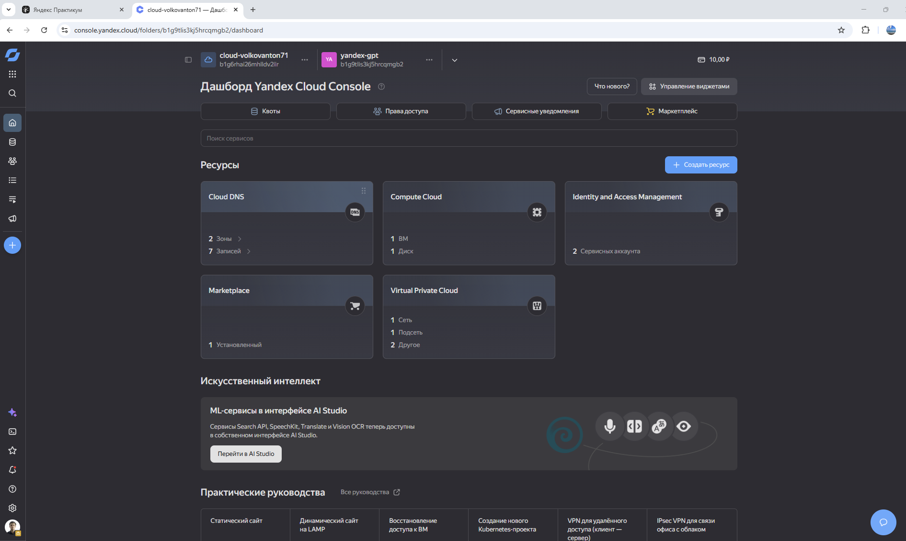
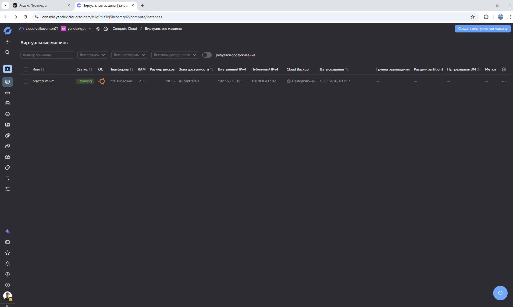
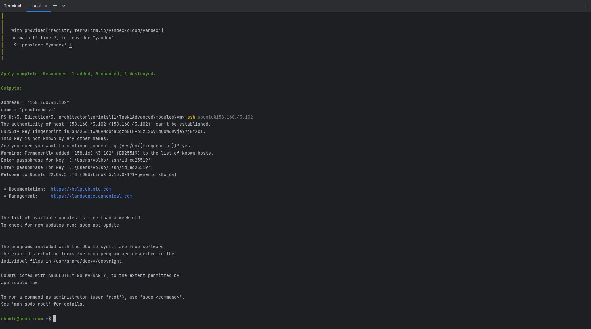

## Terraform
- установить Terraform
  - [install-terraform.md](install-terraform.md)

- описание структуры рабочего каталога
  - main.tf 
    - создаем схему Виртуальной машины и сети
    - используем только переменные - никаких значений напрямую
  - variables.tf
    - описываем типы и некоторые дефолтные значения для переменных
  - terraform.tfvars
    - значения для переменных (токены, пути, количества ядер и т.д.)
    - храниться отдельно от основных файлов
    - индивидуальная конфигурация для каждого окружения 
      - Task1Advanced/envs/dev/terraform.tfvars
      - Task1Advanced/envs/prod/terraform.tfvars
      - Task1Advanced/envs/stage/terraform.tfvars

- инициализация каталога
  - выполнить из директории /Task1Advanced/modules/vm
  - `terraform init` -
    - *Для доступа к Yandex Cloud может потребоваться VP

- проверка валидности
  - `terraform validate`

- запуск 
  - выполнить из директории /Task1Advanced/modules/vm
  - используем индивидуальный путь для своего окружения
    - `terraform apply -var-file="../../envs/dev/terraform.tfvars"`
  - подтверждение
    - 
    - 
  

- удаление окружения
  - аналогично запуску
    - `terraform destroy -var-file="../../envs/dev/terraform.tfvars"`

- подключение по SSH
  - после команды `terraform apply ...`
  - в консоли будет выведен `IP` Виртуальной машины, используем его для удаленного доступа
  - создать ключик SSH
    - [create-ssh-key.md](create-ssh-key.md)
  - указываем путь до публичного ключа
  - удаленное подключение
    - `ssh ubuntu@IP`
    - есть нюансы VPN, ибо Permission denied
    - далее соглашаемся на все `yes`
    - вводим секрет-фразу для используемого SSH-ключа
    - и мы внутри ВМ
      - 
    