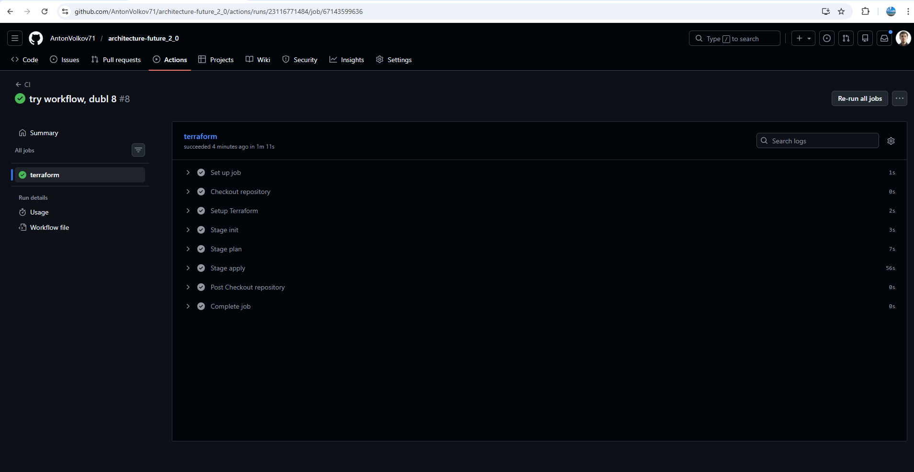
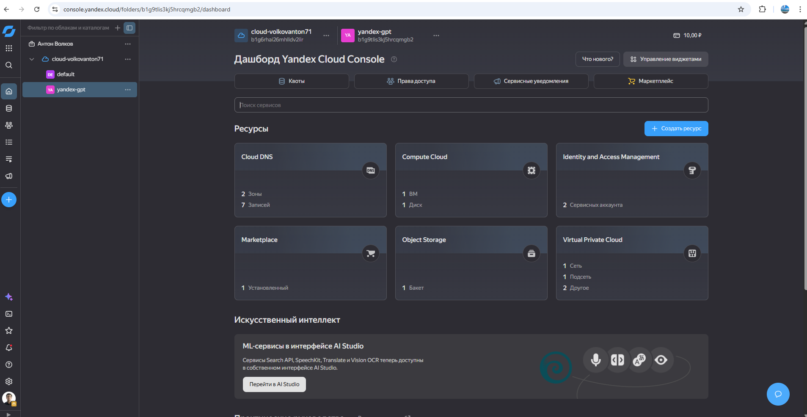
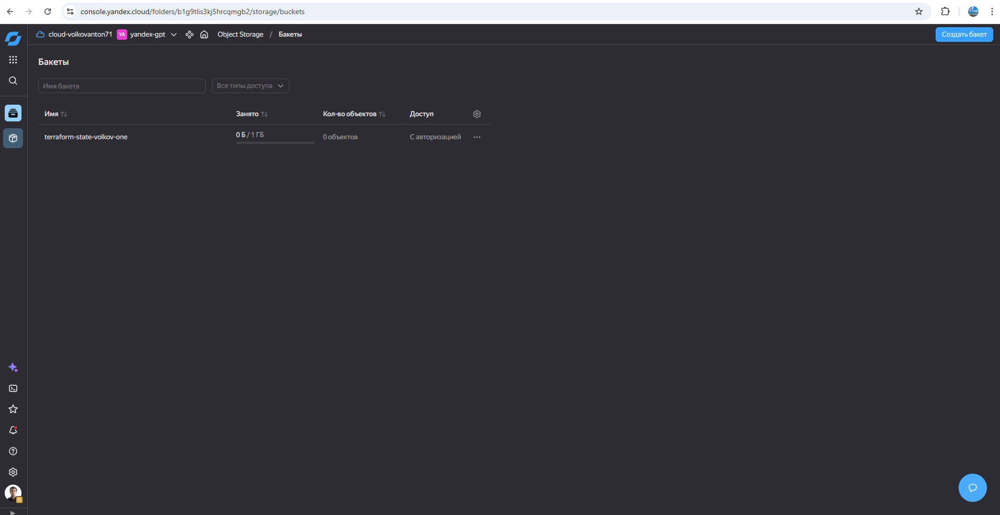
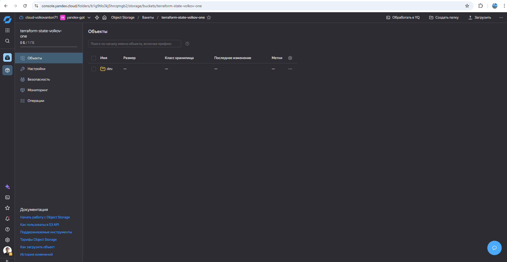
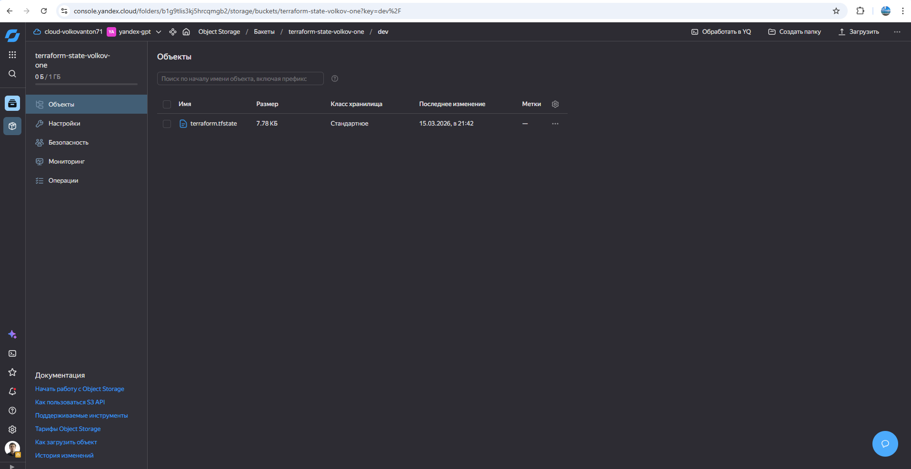

## CI/CD Back+Terraform


### Terraform S3
- перед использованием Terraforma с S3 хранилкой надо ее создать
  - создаем bucket Yandex Object Storage
  
```данные конфига
name: terraform-state-volkov-one
region: ru-central1
public access: off
versioning: optional
```

- создаем переменные в репозитории (поправка на ветер убираем все пароли, ключи из файла terraform.tfvars каждого окружения)
  - заходим в репозиторий проекта
  - `Settings -> Secrets and variables-Actions -> New repository secret`
  - добавляем переменные 
    - AWS_ACCESS_KEY_ID - наш пользователь в клауде
    - AWS_SECRET_ACCESS_KEY - его ключ
    - YC_CLOUD_ID - идентификатор консоли ya-cloud
    - YC_FOLDER_ID - идентификатор каталога
    - YC_TOKEN - OAuth токен аккаунта
    - SSH_PUBLIC_KEY - копируем открытую часть, ибо в репозитории не будет доступа к нашему локальному ключу

### CI/CD
- используем Github Actions
  - `.github/workflows/terraform.yml`
- так же используем разные переменные для окружений
  - руками выставляем `ENV: dev`
  - и далее файлы конфигураций будут браться автоматически из нужного окружения
    - `-backend-config=../../envs/$ENV/backend.hcl` - конфиг для подключения Terraform к S3 Yandex Object Storage
    - `-var-file=../../envs/$ENV/terraform.tfvars` - конфиг для подключения Terraform, но уже без паролей
  - так же в `terraform.yml` - прописали правила, чтобы переменные теперь будут браться из репозитория
- процесс CI/CD разделяем на шаги:
  - чекаем репозиторий
  - инициализируем Terraform
  - проверяем коррэктность
  - запускаем
- удаление не делаем, ибо через 10 минут он удалится

- подтверждение
  - action прошел -> в бакете создался bucket terraform-state-volkov-one -> создался объект dev -> в нем файл terraform.tfstate
  - 
  - [action](results/action.txt)
  - 
  - 
  - 
  - 
 