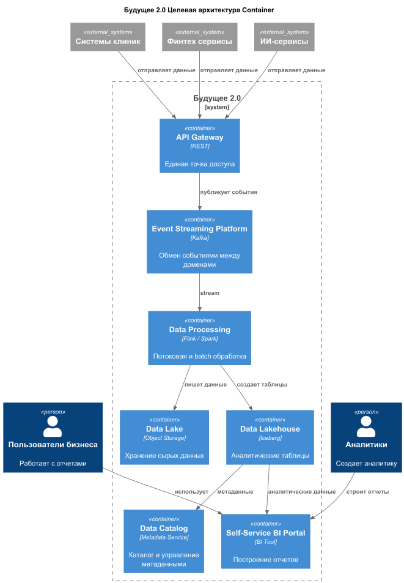
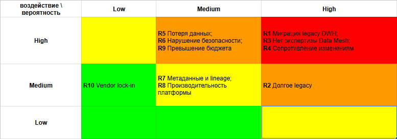

### Целевая архитектура

## беклог кратко

- 3 года, С4 контейнер, компонент
- Изменения системы и масштабирование, интеграция допов, отказ от легаси
- карта рисков трансформации, арх/орг риски, вероятность возникновения/влияние (низ, сред, выс)
- план управления рисками, меры по снижению, минимизация техническими решениями

- описание как есть
    - [as-is](../as-is/README.md)

### Архитектура

- функции
    - масштабированная обработка данных
    - независимость доменов друг от друга (слабосвязанная платформа)
    - быстрая обработка для аналитики

- принципы основные
    - DDD - доменная архитектура (дызайн)
    - EDA - событийная архитектура
    - Data Mesh - прозрачное управление данными
    - Self-Service BI - самостоятельные отчеты для сотрудников

#### Основные компоненты архитектуры

- Event streaming platform
    - основной механизм общения между доменами - событийная платформа
    - асинхронная интеграция
    - развязывание сервисов
    - используем
        - Apache Kafka

- Stream Processing
    - непрерывно обрабатываем потоки данных
    - трансформация данных
    - используем
        - Apache Flink либо Apache Kafka Streams

- Data Lake
    - централизованное объектное хранилище
    - сырые/архивные данные
    - данные для ML
    - используем
        - S3, Minio

- Data Lakehouse
    - слой поверх Data Lake - управление
    - транзакционность, управление схемами, версионность, Биг Дата
    - используем
        - Apache Iceberg

- Data Catalog
    - управление метаданными
    - поиск наборов данных, управление доступом,
    - отслеживание происхождение данных (конвейер data lineage)
    - используем
        - Datahub

- Аналитический слой (анализ)
    - витрины, отчеты
    - используем
        - Power BI

### Будущее Легаси систем

- сразу ничего не вырубаем, все работает, выводим постепенно
- используем паттерн Душитель (Strangler)
    - строим сервисы вокруг DWH (продолжает работать)
    - постепенно функции переносятся в новую архитектуру

### C4 Контейнер диаграмма
- [C4-container](schema/C4-container.puml)
- 

### Карта рисков трансформации

- риски
    - архитектурные, технологические, организационные
- для каждого риска указываем
  - вероятность, влияние на бизнес, меры

| ID  | Риск                                                        | Тип             | Вероятность | Влияние | Что делаем                                                                        |
|-----|-------------------------------------------------------------|-----------------|-------------|---------|-----------------------------------------------------------------------------------|
| R1  | Сложность миграции legacy DWH и Camel                       | архитектурный   | высокая     | высокое | поэтапная миграция, anti-corruption layer, пилот в 1-2 доменах                    |
| R2  | Слишком долгое сосуществование legacy и target              | архитектурный   | высокая     | среднее | дорожная карта/критерии вывода из эксплуатации                                    |
| R3  | Недостаток экспертизы по Data Mesh, streaming и governance  | организационный | высокая     | высокое | обучение, архитектурный комитет                                                   |
| R4  | Сопротивление изменениям и размытая ответственность доменов | организационный | высокая     | высокое | Data Product Owner, руководящий совет, ринятие ключевых показателей эффективности |
| R5  | Потеря или рассинхронизация данных при миграции             | технологический | средняя     | высокое | CDC, сверка данных, поэтапный переходный период                                   |
| R6  | Нарушение требований безопасности и регуляторики            | технологический | средняя     | высокое | IAM, RBAC/ABAC, аудит, классификация данных                                       |
| R7  | Слабое управление метаданными и lineage                     | архитектурный   | средняя     | среднее | data catalog, контракты на передачу данных                                        |
| R8  | Недостаточная производительность платформы данных           | технологический | средняя     | среднее | нагрузочные тесты, наблюдаемость, настраиваемый обслуживающий слой                |
| R9  | Превышение бюджета трансформации                            | организационный | средняя     | высокое | поэтапное финансирование, пилот с KPI                                             |
| R10 | Vendor lock-in облачного провайдера                         | архитектурный   | низкая      | среднее | только открытые форматы, S3-совместимое хранилище, Iceberg                        |

- матрица рисков
  - 

### План управления рисками
- цели
  - снижение рисков трансформации
  - обеспечение управляемого перехода от легаси к событийной платформе данных
  - сохранение работоспособности жизни (функции) бизнеса во время миграции

- риски закрываемые техническими решениями (архитектурные и технологические меры)
  - Anti-Corruption Layer (ACL) между легаси и новой системой
  - CDC-инструменты  (Change Data Capture) - отслеживание изменений в данных, происходящие в базе данных
  - event streaming platform как единая шина событий
  - schema registry и data contracts - централизованное управление и проверка схем данных
  - Dead letter queue (DLQ) - диагностика и отслеживание недоставленных сообщений
  - data catalog и lineage - управление метаданными
  - Open Table Formats (OTF), S3-совместимое хранилище
  - наблюдаемость, аудит, мониторинг

- риски закрывающие управлением (организационные меры)
  -  выделение доменных команд
  - назначение Data Product Owner
  - создание governance council (руководящий совэт)
  - обучение команд Data Mesh и Event-Driven подходу
  - ограничение новых доработок в legacy
  - прозрачные KPI по миграции

### Стратегия снижения рисков
- Этап 1. Пилот
  - выбрать 1-2 домена
  - внедрить архитектуру, основанную на шине событий (Event Backbone)
  - поднять catalog, DLQ, schema registry
  - показать первый self-service use case - сервис самообслуживания

- Этап 2. Масштабирование
  - подключить критичные домены
  - запускать domain data products - данные как продукт
  - строить потоковые витрины
  - переводить BI на governed datasets

-  Этап 3. Вывод legacy
  - прекратить новые фичи в старом DWH
  - перевести потребителей на новую систему
  - оставить legacy только как временный мост
  - удалить устаревшие каналы интеграции
