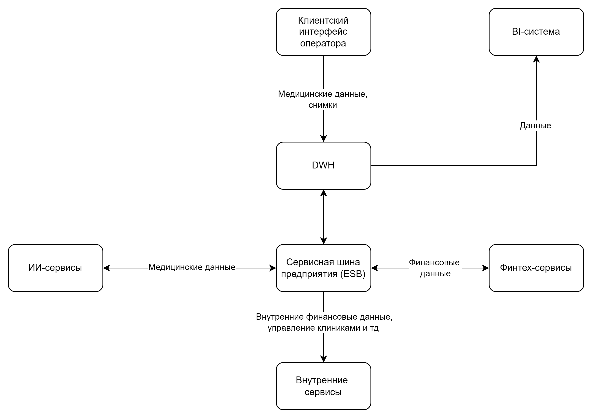

## Будущее 2.0

- Структура компании
  - головной офис
  - клиники
  - компания, предоставляющая ИИ-сервисы с мед-данными
  - компания, оказывающая фин-услуги

    
- Архитектура
  - 
  - все данные в DWH Microsoft SQL 2008
    - клиенты, мед-карты
    - финансы, счета
    - персонал, инвентаризация
    - Power BI, Power Builder
    - ESB на базе Apache Came
    - ИИ-сервисы на Python, Финтех-сервисы на Golang и Java.

- Проблемы
  - много данных - терабайты
  - большие затраты на поддержку оборудования on-rem
  - долгое формирование сложных отчетов - часы

- Планы
  - перенести инфраструктуру в облако
    - масштабирование, отказоустойчивость, резервирование, геораспределение
    - обеспечение безопасности в работе с данными
  - создать витрину данных
    - самообслуживаемый
    - масштабируемый
    - Важно! медицинские данные не используются для аналитики
    - архитектурное решение по изменению IT-ландшафта в области работы с данными

- Цели
  - Промежуточное состояние (пару месяцев)
    - Архитектурное решение по трансформации сформировано и согласовано.
    - Границы доменов определены
    - запланированы конкретные проекты по развитию «витрины данных».
  - Финальное состояние (через год)
    - Реализован портал самообслуживания.
    - Бизнес-пользователи в доменах могут работать с данными в рамках новой архитектуры.
    - На этом этапе допускается временное сохранение легаси-систем в отдельных доменах.
  - Долгосрочная цель (горизонт три года)
    - Продукты: запуск новых финтех- и медицинских сервисов, монетизация ИИ-функций.
    - География: выход на два-три новых региона
    - Данные: увеличение количества источников и событий, переход от пакетной отчётности («batch») к near-real-time обработке
  - целевая архитектура компании должна через три года представлять 
    - слабосвязанная событийная платформа
    - домены взаимодействуют через события и реактивные потоки
    - Интеграции через шину Camel и DWH используются только как «мосты совместимости» на этапе миграции.

- Этапы трансформации
  - Первый этап - период 1-6 месяцев
    - пилот на одном-двух доменах на финансовых расчетах или пациентском потоку
  - Второй этап - период 6-18 месяцев
    - трансформация на критические домены, витрины, антикоррупционные слои Camel, DHW
  - Финальный этап - период 18-36 месяцев
    - отказ от точечных синхронных интеграций
    - переход к доменной политике на основе потоков данных
